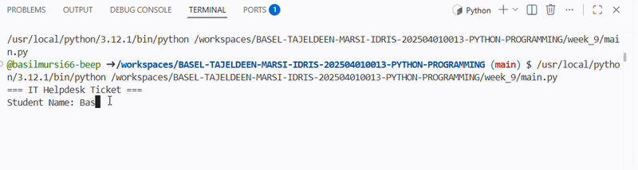

# Ticket Registration System

## 1.Purpose of the Application
The Ticket Registration System is a simple Python program that allows users to create IT helpdesk tickets for technical issues. The system records ticket details, lets users choose a priority level (High, Medium, or Low), and automatically assigns the technician responsible based on the selected priority.

## 2.Tech Stack
- Python 3
- Modular Programming
- Visual Studio Code (or any Python IDE)
- Git & GitHub

## 3.How to Use
1. Run `main.py`.
2. Enter the ticket information (name, issue, etc.).
3. Select a priority level:
   - High
   - Medium
   - Low
4. The system automatically assigns:
   - High → Ahmad
   - Medium → Siti
   - Low → Ali
5. The ticket details are displayed on the screen.

## 4.Demonstration
Record a short screen recording (or GIF) showing:
- Running `main.py`
- Creating a ticket
- Selecting a priority level
- Displaying the assigned technician
- Showing the final ticket information

